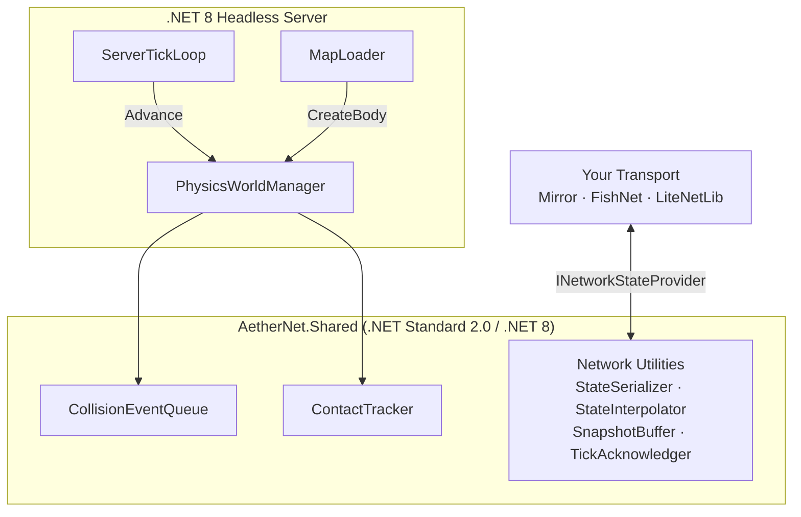

<div align="center">
  <h1>⚡ AetherNet</h1>
  <p><strong>GC-free, deterministic 2D physics for server-authoritative Unity games</strong></p>

  <p>
    
    
    
    
  </p>
</div>

---

## What is AetherNet?

AetherNet completely decouples 2D physics simulation from Unity’s native engine. A single, deterministic physics loop powered by [Aether.Physics2D](https://github.com/nkast/Aether.Physics2D) (a pure C# Box2D port, actively maintained) runs identically on a headless .NET 8 server and a Unity client — with zero runtime heap allocation.

Unity is used strictly as a visual layer. There are no `Rigidbody2D` components, no `Physics2D.Simulate` calls, and no GC pressure from the physics tick. This makes AetherNet the right foundation for server-authoritative multiplayer games where client and server must agree on physics state down to the bit.

---

## Features

- ⚡ **Zero runtime GC allocation** — flat memory profile during gameplay, pre-allocated parallel arrays throughout
- 🎯 **100% deterministic fixed-timestep simulation** — accumulator-based tick ensures identical results on server and client
- 🖥️ **Headless .NET 8 server** — no Unity license required on the game server; loads baked map files directly
- 💥 **Unity-style collision callbacks** — `OnCollisionEnter`, `OnCollisionExit`, `OnTriggerEnter`, `OnTriggerExit` via interface dispatch (no reflection)
- 💪 **Full force API** — `AddForce`, `AddTorque`, `AddForceAtPosition` with `ForceMode` (Force, Impulse, VelocityChange, Acceleration)
- 🔍 **Physics queries** — `Raycast`, `OverlapCircle`, `OverlapBox` with zero-alloc result buffers
- 🔗 **Transport-agnostic networking** — bring your own transport; plug in Mirror, FishNet, LiteNetLib, or raw sockets
- 💤 **Body sleep management** — optional broad-phase deactivation for distant bodies
- 🔒 **Rigidbody constraints** — `FreezePositionX/Y`, `FreezeRotation` applied post-step, no drift

---

## Install

```
dotnet add package AetherNet.Shared
```

Or add to your `.csproj`:
```xml
<PackageReference Include="AetherNet.Shared" Version="0.1.0" />
```

---

## Architecture



---

## Quick Start — Server

```bash
cd src/AetherNet.Server
dotnet run -- maps/level01.json
```

The server loads the baked `level01.json`, runs the physics loop at 60 Hz, and calls your `INetworkStateProvider.OnTickComplete` each tick.

```csharp
var world  = new PhysicsWorldManager(WorldConfig.Default);
var loader = new MapLoader();
loader.LoadInto(world, "maps/level01.json");

var loop = new ServerTickLoop(world);
loop.SetSnapshotCallback((states, count, tick) =>
{
    int bytes = StateSerializer.Serialize(states, count, sendBuffer, 0);
    myTransport.BroadcastUnreliable(sendBuffer, bytes);
});

loop.Run(CancellationToken.None);
```

---

## Networking

AetherNet provides **contracts and utilities**, not a bundled transport:

| Type | Purpose |
|---|---|
| `INetworkStateProvider` | Hook into the tick loop — implement to broadcast state |
| `StateSerializer` | Zero-alloc binary write/read of `EntityState[]` arrays |
| `StateInterpolator` | Client-side snapshot lerp — smooths 20 Hz network updates to 144 Hz render |
| `SnapshotBuffer` | Circular buffer of authoritative snapshots |
| `TickAcknowledger` | Bitmask-based ack tracking for delta compression |

See **[`examples/LiteNetLibExample/`](examples/LiteNetLibExample/)** for a complete working implementation using LiteNetLib.

---

## Performance Guidelines

- **No LINQ in hot paths.** Use raw `for` loops in physics callbacks.
- **No `GetComponent` at runtime.** Cache all references in `Awake`.
- **Never feed `Time.deltaTime` to physics.** Use the accumulator exclusively via `Advance()`.
- **Pass large structs by `in` or `ref`.** `CollisionData`, `TriggerData`, `BodyDef` — never copy by value in hot code.
- **Pre-allocate result buffers.** `PhysicsQueryBuffer` is created once and reused indefinitely.

---

## Contributing

1. Fork the repo and create a branch: `feature/your-feature` or `fix/issue-description`.
2. All changes to `AetherNet.Shared` must pass `dotnet test`.
3. PR checklist:
   - [ ] `dotnet build AetherNet.sln` with no errors or warnings
   - [ ] `dotnet test` — all tests green, determinism tests pass
   - [ ] No new GC.Alloc in hot paths
   - [ ] New public API documented with XML summary comments

---

## License

[MIT](LICENSE) — free to use in commercial and open-source projects.
